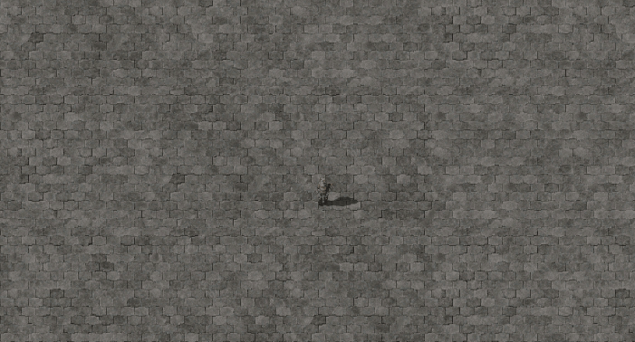
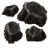

# Parlatorio Docs

## Sumário

1. [Movimentação](#movimentacao)
2. [Inventário](#inventario)
3. [Energia](#energia)
4. [Transportando e Carregando](#transportando)
5. [Minerando](#minerando)
6. [Fundições](#fundicoes)
7. [Máquinas de Montagem](#montagem)

### Movimentação  

#### Andando

Use as teclas <kbd>W</kbd> <kbd>A</kbd> <kbd>S</kbd> <kbd>D</kbd> para se movimentar.

<kbd>W</kbd> para cima

<kbd>A</kbd> para esquerda

<kbd>S</kbd> para direita

<kbd>D</kbd> para baixo

As combinações das teclas permite movimentação na diagonal (ex: <kbd>W</kbd> + <kbd>A</kbd> movimenta para a diagonal superior direita)

#### Zoom

O <kbd>scroll</kbd> do mouse aumenta e diminui o zoom.

#### Mapa

A tecla <kbd>M</kbd> abre e fecha o mapa.

---

### Inventário  

#### Abrir Fechar Inventário

A tecla <kbd>E</kbd> abre o inventário.

#### Baús

Baús guardam items, é possível depositar ou retirar items deles para o inventário e vice-versa.

:boom: DICAS QUENTES :boom:

- Clicar com o botão direito do mouse pega metade do stack desejado (no exemplo: braço mecânico tem stack de 50, usuário pega 25)

- Segurar a tecla <kbd>CTRL</kbd> e clicar com o botão esquerdo em um item, movimenta TODOS os itens do mesmo tipo (no exemplo: pega todas esteiras de uma vez)

#### Barra de Favoritos

É possível arrastar itens do inventário para a barra de favoritos. Para limpar a barra de favoritos, clique com o botão do meio do mouse.

:boom: DICA QUENTE :boom: 

- A tecla <kbd>Q</kbd> 'deseleciona' o item clicado, <b>é muito utilizado</b>.

---

### Energia  

A grande maioria dos elementos de trabalho exigem energia. A energia é fornecida por uma central e distribuída por postes.

Caso o ícone acima esteja piscando, o elemento em questão está sem energia e deve ser conectado a uma rede de energia.

O raio de ação de um poste é determinado pela área azul ao redor dele (passe o mouse por cima).

Garanta que existam fios entre os postes, eles são criados automaticamente quando obedecem uma distância mínima.

:boom: DICA QUENTE :boom: 

- Com o poste selecionado (e um número razoável de postes no invetário), pressione e segure o botão esquerdo do mouse e se movimente. Uma linha de postes otimizada será criada pelo caminho que você andar.

---

### Transportando e Carregando  

#### Esteiras e produtos

As esteiras são o principal meio de locomoção do jogo. Por elas é possível transportar materiais crus ou produzidos.

#### Construindo Esteiras (Colocar, Tirar, Rotacionar)

Para construir uma esteira, basta ter a esteira selecionada e clicar com o botão esquerdo do mouse. 

A tecla <kbd>R</kbd> rotaciona a estrada, é possível colocá-las nas 4 direções.

Para retirar uma estrada mal posicionada, clique e segure com o botão direito do mouse.

#### Dois lados de uma esteira

Uma esteira pode carregar materiais por dois lados (podendo ser dois materiais diferentes - cuidado!).

#### Separador

É possível separar ou unir faixas de esteiras com o separador. <b>Importante para dividir recursos</b>.

#### Esteira subterrânea

É possível fazer com que uma faixa de esteiras passe por baixo de outra se estiverem perpendiculares, usando as esteiras subterrâneas.

#### Estrutura em Cruz

A estrutura mais simples para colocar dois elementos em uma esteira é a Cruz.

#### Balanceando uma esteira

É possível balancear uma esteira com um separador e uma esteira extra redirecionando a separação.

#### Braços mecânicos

Os braços mecânicos jogam elementos do ponto A para o ponto B. Durante a construção, o item que está do lado da 'barra' será carregado para o lado da 'seta'.

É necessário energia para o braço funcionar.

O braço pode retirar e colocar items:

- em esteiras (ao retirar, pega dos dois lados - ao colocar, escolhe um lado)
- em baús
- em fundições
- em máquinas de automatização

:boom: DICAS QUENTES :boom:

- É possível construir uma faixa de esteiras mais rapidamente segurando o botão esquerdo do mouse e andando reto para a direção desejada.

- É possível se movimentar mais rápido (ou devagar) andando sobre uma faixa de esteira.

- Preste atenção na direção do braço mecânico (barra vs. seta), é um erro comum. A base visual do braço dá uma dica também da direção que está apontado, duas perninhas (barra) recebe, uma perninha (seta) entrega.

---

### Minerando  

Minério bruto é o elemento base para todas as construções. Eles têm o formato de 'pedrinhas' e são diferenciado por cores:

- Preto é o CARVÃO
- Marrom é o COBRE
- Azul é o FERRO

É possível retirar minérios do chão com a mineradora, ela precisa de energia para funcionar e deve ser colocada sobre uma camada de minérios qualquer.

A seta para onde a mineradora aponta é aonde será depositada a pedra do minério extraído. É recomendado jogá-lo em uma esteira ou em um baú, senão a mineradora para de funcionar por estar 'entupida'.

:boom: DICAS QUENTES :boom:

- Mais mineradoras, mais minérios.

- Cuidado para não colocar uma mineradora sobre dois minérios diferentes. É um erro comum.

---

### Fundições  

Minério bruto pode ser transformado em chapas usando a Fornalha de Aço.

- Minério de Cobre em Chapa de Cobre
- Minério de Ferro em Chapa de Ferro

Uma mineradora precisa do minério desejado para chapa + um minério de Carvão para criar uma Chapa do minério desejado.

---

### Máquinas de Montagem  

É possível construir produtos mais complexos com a máquina de montagem, seguindo os seguintes passos:

- Escolher a receita do que você quer construir
- Fornecer os materiais necessários

Para escolher uma receita, clique em uma máquina de montagem 'virgem' (recem-colocada ou limpa) e escolha o produto necessário.
<b>Todas receitas da dinâmica estarão na terceira aba da máquina de montagem.</b>

:boom: DICA QUENTE :boom:

- Apertar a tecla <kbd> ALT </kbd> ou <kbd> CMD </kbd> mostra a receita que está sendo construída no momento.

Receitas para a dinâmica:

- Fio de de Cobre

 feito com 1 

- Engrenagem

 feito com 1 

- Circuito Eletrônico

 feito com 1  e 3 

- Poção Vermelha (Pacote Científico)

 feito com 1  e 1 

---

#### :boom: Mais DICAS QUENTES :boom:

- Espaço também pode ser considerado um recurso, planejamento antes de construir garante organização.

- Linhas de produção podem (e devem) ser desenvolvidas, uma esteira de recursos abastacendo várias estruturas geralmente é o melhor caminho para uma produção maior e mais eficiente.

- É possível limpar manualmente uma esteira segurando a tecla <kbd>F</kbd>, cuidado, pois os itens vão para o inventário pessoal.
